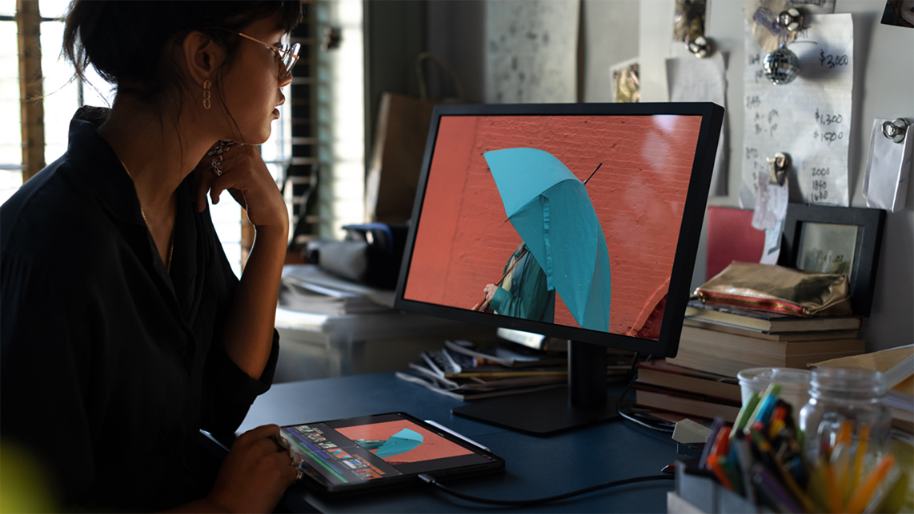

Cupertino & Friends© are, if anything, purposeful. 

When ensuring iOS icons would be nothing short of flawless, it's been said that Scott Forstall kept a jeweler’s loupe in his office to check that each pixel on _every_ icon was exemplary. Talk about "pixel perfect". The man himself apparently even [debated the shade of grey](https://www.businessinsider.com/steve-jobs-attention-to-detail-2011-10#when-he-was-hospitalized-he-rejected-masks-because-they-were-ugly-8) that should be used for the Apple Store's....._bathroom signs_.

If we are to believe that no one single act is executed without astute purpose from Apple, we then must pay attention to the once puzzling introduction to WWDC 18's session, ["Adding Delight to your iOS App"](https://developer.apple.com/videos/play/wwdc2018/233/), which began covering supporting external displays. Why spend time going over an API that hasn't seen significant changes circa 2011? 

It seemed like the session was being conducted by a preacher with no pulpit. However, with the recently announced iPad Pro sporting USB-C and Thunderbolt 3 capabilities, the missing context is now present. Today, let's talk about supporting external displays in our iOS apps.


### Window Quotes
It all begins with a homologically titled object in UIKit, the `UIWindow`, and respecting the responsibilities that it represents. At its core, a window acts as a container for anything that should be on screen. We often don't think of it much beyond its initial setup within the app delegate:

```swift
func application(_ application: UIApplication, didFinishLaunchingWithOptions launchOptions: [UIApplicationLaunchOptionsKey: Any]?) -> Bool 
{
    let controller = ViewController()
    
    window = UIWindow()
    window?.rootViewController = controller
    window?.makeKeyAndVisible()
    
    return true
}
```

> If your app uses storyboards, the above is done for you. This is one reason why Xcode templates its app delegate objects with a `UIWindow` property.

With that, we end up with a hierarchy that is stacked up like so, from bottom to top:

- Device
- Window
- View (from the window's root controller)

Typically, it's fine to move on and not think much about it. A window won't do anything more than pass on any relevant events to its root controller (which in turn travels the down responder chain with its associated views). It provides no visible content of its own, merely acting as a harbinger of sorts for things happenings that would affect its root controller.

But its utility lies in the fact that your iOS app can break free from the confines of an any iPhone or iPad (...or iPod touch, I guess) by way of being connected to another display. 

And Apple _really_ wants us to know that the new iPad Pro is ready for such occasions. By default, when iOS detects another screen UIKit will mirror the key window's contents. But, look at the marketing for the Pro:



If you inspect the image closer you'll notice that what's showing on the monitor versus what's on the iPad are *different*. **This** is the opportunity Apple wants developers to be aware of. Let's walk through it.

### The Setup
When thinking about how to be a first class citizen for supporting external displays, there really isn't much involved from an engineering perspective. In the aforementioned WWDC session, three main concerns are laid out: 

- Connectivity: Handling the presence of another display.
- Behavior: How your app should respond to that connection.
- Connection Transitions: Handling the removal of another display.

### Connectivity
The first logical step is to be aware of when one should prepare interfaces for an external display. UIKit offers us two discrete responsibilities to consider. The first is the `UIScreen` singleton, which has an array of screens the app is tracking:

```swift
class var screens: [UIScreen] { get }
```

This is where we can snag a reference to the screen we need. In addition to housing a controller and its views, `UIWindow` also has an assignable `UIScreen` property. With it, we can control which screen each window should display its contents on.

The process looks similar to the following:
```swift
if let externalScreen = UIScreen.screens.last 
{
    let externalWindow = UIWindow()
    externalWindow.screen = externalScreen
    externalWindow.rootViewController = UIViewController()
    externalWindow.isHidden = false
}
```
> By default, a window's screen property is set to the hardware's current screen. For a window that'll show unique content on an external display, set it before you show the window as switching screens on an already displayed window carries significant performance costs.

It's at this point that you'd want to supply the relevant content to the new window's `rootViewController` property. So, for the image above showing the iPad Pro, Apple has created a controller that just shows the primary content and not the editing tools below it (as on the iPad's screen).

The execution is easy to follow, but knowing when to do the work above is accomplished by way of Cocoa Touch's oldest broadcasting network - `NSNotification`.

In particular, there are two:

- `NSNotification.Name.UIScreenDidConnect`
- `NSNotification.Name.UIScreenDidDisconnect`

If you were wondering why we set the `screen` property on the window to the last instance in the array, this is why. That code should be responding to first notification above, thus indicating to us that the last screen is the external display we're after:

```swift
NotificationCenter.default.addObserver(forName: .UIScreenDidConnect, object: nil, queue: nil) { (connectNotice) in
    let extScreen = notification.object as! UIScreen
    let extScreenBounds = extScreen.bounds
    
    // Our unique content
    self.extWindow = UIWindow(frame: extScreenBounds)
    self.extWindow.screen = extScreen
    self.extWindow.rootViewController = UIViewController()
    self.extWindow.isHidden = false
}
```

The flip side looks about the same, except undoing all of the fine work you did above:

```swift
NotificationCenter.default.addObserver(forName: .UIScreenDidDisconnect, object: nil, queue: nil) { (disconnectNotice) in
   let extScreen = notification.object as! UIScreen

   if extScreen == self.extWindow.screen 
   {
        self.extWindow.hidden = true
        self.extWindow = nil
   }
}
```

Disconnects are trivial to handle, due to the fact that UIKit bears most of the burden. Simply assigning `true` to your window's `hidden` hidden property and nilifying (nillifying, nil-lify, nillin'?) the instance tears everything down. No other tomfoolery required.

**Bonus Points - Screen Resolution** <br />
It's not too uncommon for screens, especially external ones, to change their resolution. Consider dual monitors connected to a mac; I often pop into display preferences to make things look just how I want. The process of doing so always ensures that the scale, transforms and general look of every interface currently open immediately looks like they just dropped 14 pounds of acid.

To ensure a drug free interface, opt to respond to `UIScreenModeDidChangeNotification`:
```swift
NotificationCenter.default.addObserver(forName: .UIScreenModeDidChange, object: nil, queue: nil) { (modeNotice) in
    if let extScreen = modeNotice.object as? UIScreen, extScreen == self.extWindow.screen
    {
        self.view.setNeedsLayout()
        self.view.layoutSubviews()
    }

}
```

### Behavior
It's important to note that whatever you're planning on displaying on the screen won't be directly interactive. All of that interactivity will still be driven by the iOS device. This means that you'll want to set things up accordingly, likely reserving all this new screen real estate to display the marquee parts of your content. 

The reason why is simple - the external display likely won't have touch controls. I say likely because, to wit, the only way I suppose it _could_ is if it's another iOS device using external display software.

Unlikely edge case notwithstanding, the main idea is that it's a giant projected display, so treat it like one:

```swift
if extDisplayShowing 
{
    presentContentOnExternalDisplay(content)
}
else
{
    let contentDisplayController = UIContentDisplayViewController(with content:content)
    navigationController?.pushViewController(contentDisplayController, animated: true)
}
```

The paradigm is different. This is your chance to show off the most important, public components of your content while ensuring control of said content stays snuggly nestled within the iOS device.

### Connection Transitions
The last piece laid out by the fine engineers of Cupertino during the session was this idea of "connection transitions", but really it's chiefly concerned with the first step.

Essentially, as iOS engineers there is one thing we must always strive to keep for users: context. 

It's incredibly frustrating to use an app that doesn't respect it. Tap a row with a disclosure indicator, and instead of pushing onto the navigation stack you get some off beat modal transition. Or if there is a side menu, tapping it _does_ do a push. It's weird, and you know it when you see it. Ambiguity in software is inherently taxing to the end user, so it's best to avoid it.

When you receive a connect or disconnect notice, strive to keep the current context and flow of your app maintained. For our example above, it might look  something like this :

```swift
NotificationCenter.default.addObserver(forName: .UIScreenDidDisconnect, object: nil, queue: nil) { (disconnectNotice) in
    let contentDisplayController = UIContentDisplayViewController(with content:content)
    navigationController?.pushViewController(contentDisplayController, animated: true)
}

NotificationCenter.default.addObserver(forName: .UIScreenDidConnect, object: nil, queue: nil) { (connectNotice) in
    presentContentOnExternalDisplay(content)
}
```

> If your app is suspended when a notification arrives, UIKit delivers it when your app begins running again.

It's about thinking of any context that _could_ be lost from any of these transitions that should later be restored. So, be thinking about currently selected index paths, selected content or view hierarchies that you might need to do some bookkeeping for to later restore.

### When, and Why
To me, real craftsmanship shows through when external display support is provided in a way that, forgive my stereotypical phrase - truly enhances the app's experience. 

Think of Keynote. The iOS app can turn into a clicker to present the slides, or a game that houses controls locally on the phone but projects meaningful game play on your giant TV. External display support really shines here - whereas an app like [Streaks Workout](https://www.streaksworkout.com){:target="_blank"} does just fine with mirroring its contents. It doesn't stand to gain anything by providing any other support to external displays.

It's a matter of real life access control. Public or private. Your iOS device is almost always private. All of us get a little nervous when projecting it onto a huge screen in the office to show just that _one_ picture. But like programming, we must consider context. The external display is public - so ask yourself what your app might stand to gain, if anything, by making content publicly shown that's entirely unique to its display.

### Wrapping Up
If hipster culture has taught us anything, perhaps its unintentional wisdom shows us that sometimes what's old is new again. Supporting external windows doesn't require any shiny new API, and the process of how to do it isn't lighting up your Twitter feed.

But the core ethos of iOS development is marrying hardware with software, and promoting their tight coupling with startlingly efficient execution. So I would submit to you, supporting and coding against external display support is absolutely nothing new - but it is more _relevant_ to us than it was before [Apple's event](https://www.apple.com/newsroom/2018/10/new-ipad-pro-with-all-screen-design-is-most-advanced-powerful-ipad-ever/).

Until next time ✌️.