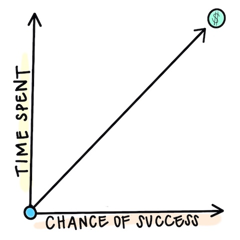
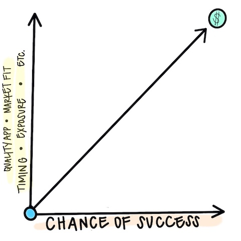

There is a certain optimism that surrounds your side project to others in your immediate circle. Take my wife, for example. What has she seen me do for the past several years?

- Stay up late coding. 
- Get up early designing. 
- Finding any ounce of free time to squash a bug.

To her, the whole thing is quite admirable. The undeniable grip that takes hold over developers when they hatch a side project is a cosmic force that requires a first hand account to be adequately understood.

As such, they might view our side project's shot at success a little something like this:

In theory, that seems reasonable. In practice, it's nothing but smoke and mirrors. 

### What We Hope For
People are creatures of habit. We've grown up applying a certain formula for success that doesn't transcend over to software development. That formula looks a little like this:

`effortPutIn + experience + talent = success`

It's ingrained into our D.N.A. early on, as well it should be. I even tell my oldest son, who is obsessed with basketball, that all of his hard work will pay off. And it likely will, too.

- Practice shooting daily? Make the shot in the game.
- Studied for the test? Get a good grade.
- Ate less pizza and worked out more? Get a fit body.

But in the world of apps, we know this doesn't hold water:

- Spend years on an app? Get a million downloads.

For indie developers, hard work can very well mean close to nothing in terms of downloads.

### What We Get
I don't say any of this to discourage you. Hang with me, though. We're trying to create and release software in a place where:

- Exposure means everything, but it's far from guaranteed.
- The biggest names in publishing are manning marketing machines to accomplish the very same goals that you are.
- Consumers have been taught (by us, no doubt) that they really don't need to pay us anything to gain value from the things we make.
- The apps that they _did_ take a chance on [possibly left a terrible taste in their mouth.](https://techcrunch.com/2018/10/15/sneaky-subscriptions-are-plaguing-the-app-store/){:target="_blank"}
- And of course, the store you're putting your creation in has 1,000s of new entries daily.

That description doesn't exactly make for a good one sheet, does it? The point is that the time I'm spending developing my app, commercially speaking - could be time wasted.

### The Realistic Chart
There is reason for optimism though, and at this point I think it's only fair to lay a little bit of sunshine down. Time spent on your app, certainly, is part of your path to success. 

And if I've done one thing, I have given it time. 

I joke that my side project is _kids_ years old. I initially envisioned and released the first version when my oldest, Bennett, arrived (he's now 5), I was redesigning it when Remy was born (he's two) and I'm gearing up for release now that my youngest (Baylor) is 5 months old. **My app is three kids years old.**

Having a side project while being married, a parent of three and having a full time career is akin to undertaking concurrent programming blindfolded. You're hoping to achieve all these tasks in anything but a synchronous queue - while knowing full well you’re going to deadlock anyways. No matter what. 

The good part is that a lot of little things help make an app great, of which time is only an ancillary component. Here is a chart that more closely relays the truth:

It's a thousand little things, a high degree of quality, a problem worth solving having been solved, some happenstance, lucky breaks and market fit that will make your app succeed. 

### Know Your "Why"
The part that keeps me motivated, though - is that _you_ get to define what success looks like. It's mutable, and typically it means something a little bit different to all of us with some evergreen themes attached to each of the definitions we hold. Though the playful charts show a dollar sign to signify success, it doesn't have to look like that for you.

So, what's success in your case?

#### Are you trying to be commercially successful? Are you actively trying to make something that could take hold of the market?

It's probably wise to release quickly and learn. You're acutely aware of the chart that lies, and the speed with which you approach the App Store is your primary weapon to wield against it. You know there's nothing wrong with wanting to make a buck, and you believe it can still be done in the market while carving out a space for yourself to earn some of the annual record breaking dollars consumers are spending within it.

Conversely, maybe you're closer to how I think about developing an app:

#### Are you a hobbyist who might be obsessed with the details? Do you consider your app an open canvas, and yourself the craftsmen?

Is releasing something that you can feel proud to put your name on key to you? Do you want it to be so intricately woven and tactfully integrated into the iOS platform that it wouldn't feel out of place alongside the best in the business? Would you consider tuning data source updates carefully to perform batch animations anything but a vapid endeavor?

Fantastic! Let's have coffee together! 

We can wax poetic about which H.I.G. rules to follow religiously and which to toss aside. Let's chat about the myriad of possibilities this wonderful world opens up for us to create. We can hammer home that the things we painfully left out of our software were equally as important as the parts we left in.

But devs like us, we _really_ have to be cognizant of the chart that lies. As times goes on, we start believing in it and consider the time we've spent will breed success instead of the real, tangible reasons that make an app work. I'd urge you to think realistically about it. If you chart the same path I'm on with your app, realize you're riding off a lot of assumptions. 

All of the time spent is great, it means something - but it owes us absolutely nothing. 

### That Money Thing
Regardless of the path you choose, it doesn't have to be squarely about the money, but you do need to make _some_ money to truly care about it. At least I do. Tell me how motivated you'd truly be if week after week you keep showing a movie that nobody wants to see.

Plus, the almighty dollar is an adroit motivator. But, it can be but a small facet of why you develop an app. I think I've found this middle ground where I'm certainly not going full-on lean startup, but I'm not eschewing the reality of what users in the market will think or how they'll react when they get my app in their hands. 

I want them to love it. But the only way I'll ever know if they will is if I actually release it.

### Wrapping Up
If you find yourself hanging your hat on the chart of lies, don't feel embarrassed. It's only natural that as time passes, you become more attached to your "baby". As such, it couldn't possibly end up as anything other than great, _right_?

The App Store tells us a different story. Does your app resonate with the audience you're after or will it be coldly ushered into non-existence without so much as a download? Take care to not let that thought discourage you, but be aware that it exists.

Savor developing your creation, but remember that time doesn't necessarily breed success. Only a great app does.

Until next time ✌️.

