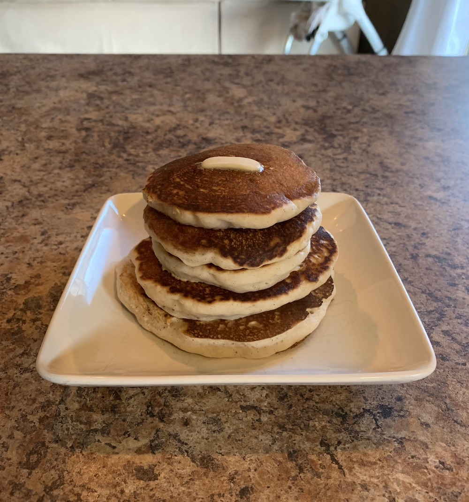

Wouldn't you know it - today I made some pancakes for breakfast. I know, I know - pics or it didn't happen:

And it was the weirdest thing. 

As I was sitting there mixing up the batter, getting the cast iron skillet heated up _just_ right - I found myself humming along as I popped on Spotify to give me some tunes to push these from good-enough pancakes to straight up artisanal masterpieces. I wasn't rushed at all. For whatever reason, I was only completely focused on making these pancakes and I was having the time of my life.

For me, that's huge.

### What I Wasn't Thinking Of
Life is busy for all of us. As a married dad of three kiddos, I find myself objectively busier than I used to be. Given that, I find that there's times when my mental space and anxiety can constantly be playing their "Greatest Hits" album over and over:

- How can I find time to release this side project?
- Will it even matter when I do? [Time spent on it doesn't really matter.]({{ site.url | append:"/the-chart-that-lies" }}){:target="_blank"}
- Beyond side projects, how do I do even better at my job?
- Oh yeah - real life. When am I going to finish all of this laundry?
- I'm so close to being out of debt, it's exhausting putting all my disposable income towards it.
- But then, do I just trade debt payments for saving for a down payment on a house? I want to enjoy my good income for once! Maybe I'll buy a new iPad.
- Hmm, that's a lot though. Wow, you know what - it's crazy that my oldest will need a cell phone before I know it!
- Oh shoot - **all** of my kids will need a cell phone 😬!
- and a car 😬😬, 
- and go to college 😬😬😬, 
- and also probably get married 😬😬😬😬.
- 💀.

The point is, I typically would not take time to make any pancakes. Let alone, during a weekday. There's just too much to do that I simply can't afford myself the joy of cracking open a box of premade pancake batter and seeing them through to fruition. Ouch.

### When Life Hits You with a SIGABRT()
When you find yourself thinking ahead so fast that you can't take the time to make pancakes, or enjoy a movie on Netflix or just take 15 minutes to talk with a loved one - you have to realize that's your brain telling you to quite literally relax.

If you're at this point, you might be carrying on like I do when I need to chill out but haven't realized it yet:  
**Did your mom call you?** _I'll call back later, I need to finish this post._  
**Is it nice outside?** _I'll take the walk another time, this project needed to finish up yesterday._ 
**A new video game out you'd enjoy?** _I'll play it later, I've gotta ship my side project now so I can learn from users, otherwise I won't be following the lean startup principles!_ 
**Dreaming of starting a new venture?** _What's the point, our C.E.O. is only a year older than me and he's already created a multi-million dollar business. I can't replicate that._    

You aren't at all a bad person if you do these things, I think we all do. Most texts suggest ways to avoid those situations all together, but I personally don't find that a realistic goal. 

No matter the epiphany you experience today, tomorrow or the next week you'll eventually start back on your old ways. I think that's healthy, actually - if we didn't, we'd never start back in on working towards our goals again. Like anything - the answer is balance. 

### Finding the Pancake Moments

Why was it that I felt so peaceful, calm and balanced today? Enough to wake up early and jam on some delish pancakes. I've yearned wanted to answer that type of question for a long time. And, being an engineer, long ago I started to document my "pancake" moments when they did pop up to later try extrapolate why they arrived.

What I've found really isn't that exciting. There are a few commonalities among the corpus - such as a vacation or time off on the horizon, a date night with my wife, a fun event with one of my kids is coming, etc. But as I dug deeper into my Day One journal archives, I began to realize that I typically only journal when I'm at a high point.

This was convenient for my current investigation, but the reality is that I couldn't really nail down why sometimes I take time for myself, and other times I don't. This time, I'd have to accept that this wasn't a problem I could analyze several different ways and apply several late nights to eventually uncover the answer to.

> As a funny aside, when I was digging through my journal during this time my wife popped around the corner and casually asked "Watcha doin?". I said I was simply reading my journal, as saying I was in the middle of an in-depth investigation into why I can let myself relax enough to make pancakes and generally be normal was too odd of an answer.

The truth is that taking time to enjoy life's many simple pleasures isn't something that's a trivial matter. If it was, there wouldn't be numerous books, conferences or classes explaining how to do it. This blog post certainly doesn't offer up the silver bullet either.

What we can do, then, is simply take our own advice - _savor_ and _enjoy_ those little "pancake" moments when they come. Even if we can't replicate them systemically, we can take heart that there is assuredly another one on the horizon. 

Conversely, just as important is being sure not to put them off. If you do, you're the lucky winner of free conference tickets to BurnOut Conf. Neglecting some time for yourself is like putting a band-aid over a bullet hole. Eventually, you're gonna feel it.

### Wrapping Up
As indie developers, we find ourselves punishing our drive and a perceived lack-thereof if we don't spend each free moment working towards our app, but then we put ourselves into a mental rut if we always do. But honestly, I'm kinda okay with life's ebbs and flows - enjoying the times when I'm magnificently firing on all cylinders and all is in order, as much as the chaotic weeks where I feel like everything is just not working out.

This isn't a novel, new or groundbreaking realization. In fact, any of your favorite authors found on the interwebs have likely written about it in their own way at some point.

And yet - so often I find myself needing to be reminded of it.

So if I may be so bold, perhaps you don't need a huge life change, to work constantly to ship the side project, or read a self help book while implementing some other drastic change (or maybe you do, that's cool too honestly). 

Maybe you just need to make some freakin' pancakes 🥞.

Until next time ✌️.

