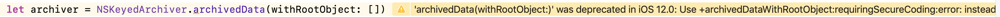

Every year when Apple announces a new operating system, I find myself transfixed to the now famous word cloud slide (or tag or bubble cloud depending on who you ask). I'm talking about the "Oh Yeahs" and the "We also did this" API changes that weren't deemed worthy enough of a call out during the keynote or state of the union address. Thus, such changes will find themselves relegated to its own cozy corner within the word cloud slide.

However, I find that I have quite a predilection for such API changes. The ones that might not make the press or be the chatter among devs undoubtedly taking over each coffee shop in San Jose are the ones which are often extremely valuable to our work. They just aren't as "sexy", as such, the spotlight eludes them. 

This week, let's chat about one such enhancement that's been around since iOS 6, `NSSecureCoding`. 

### Archiving and Serialization
Every iOS app will eventually be a consumer, or producer, of some sort of data. This data can represent itself in several different ways, each of which requires its own nuanced approach in terms of security and how its used:

- **Raw Data:** The actual stream of bites representing information.
- **Primitive Data:** A [UTF](https://en.wikipedia.org/wiki/Unicode#UTF){:target="_blank"} representation of primitive data. On iOS, this typically ends up as JSON.
- **Structured Data:** This is how you've chosen to model your data in a strongly typed way. Think of taking some primitive data, and injecting it into a model.

At each point in the life cycle of some data, there are different ways in which developers must handle it. For example, if you are expecting a tiny text file to be returned from your server - you might be tipped off that something is dreadfully wrong if the file is ten gigs when its still in a primitive state:

```swift
struct DataChecks 
{
    static let maxTextSize = 1048576
}

let textData = someTextFile()

guard textData.length < DataChecks.maxTextSize else 
{
    // Funny business
    return
}

```

Conversely, one would also be aware of some tomfoolery afoot if deserializing that data to JSON brought about a much different result:

```swift
let data = NSData()
let parsedJSON:Any

do {
    let option = JSONSerialization.ReadingOptions(rawValue: 0)

    // If this works, we know the data will be strings/arrays/etc.
    // Things like XML, for example, would fail here.
    parsedJSON = try JSONSerialization.jsonObject(with: data as Data, options: option)
} catch { /* Dragons.here */ }
```

Whether its by using a some type of checksum on a raw data blob or ensuring primitive data becomes what you expect it to, as a programmer you're actively taking steps to make sure that the data you're playing with, plays nice. 

Then, down the road, the data eventually needs to make its way on disk. Consider this example of caching some posts in a hypothetical blogging app:

```swift
class Post: NSCoding
{
    var title:String?

    // For brevity these are unimplemented...
    func encode(with aCoder: NSCoder)
    { /* Imagine this is donesis */ }
    
    required init?(coder aDecoder: NSCoder)
    { /* And this too */ }
}

// Later on down the road, you might do something like this...
func updatePostsCache()
{
    let saveURL = URL(fileURLWithPath: "someDestination")
    let archiver = NSKeyedArchiver.archivedData(withRootObject: posts)
    try? archiver.write(to: saveURL)
}

// And eventually get it back out...
let postCache:[Data] = /* Data loaded up */
let posts = try postCache.map { postData in
    guard let postBlob = try NSKeyedUnarchiver.unarchiveTopLevelObject(with: postData), let post = postBlob as? Post else { throw /* Error handling */ }
    return post
}
```

And, just like the scenarios above, malicious actors could step in at this point as well. Foundation would rather not have that happen, but it also could use your help to ensure that it doesn't.

### Understanding the Unarchiving Pipeline
To get a feel for how things could go wrong here, it's key to understand what exactly `NSKeyedUnarchiver` is doing when it unarchives your structured data. When your data is stored, it'll look a little something like this in the archive:

```json
{
    "$class":"Post",
    "title":"..."
}
```

Later on, when one goes to pull it back out via unarchiving, `NSKeyedUnarchiver` will dynamically look for a class with the same name of the key (passed in via its initializer) in your app's bundle. Then, a few things happen:

- An instance of that class gets allocated in memory
- Then, it's initialized to allow it to decode 
- Lastly, `awakeAfter(using:)` gets invoked to allow for any final state considerations

That all looks reasonable, but consider this - the unarchiver will do this on _whatever_ key you pass. So if a #TerribleHumanBeing injected some nonsense in there, this is what happens:

```swift
unarchiver.decodeObject(forKey: NSKeyedArchiverRootObjectKey)
BadTerribleThings.alloc()
BadTerribleThings.init?(coder:)
BadTerribleThings.awakeAfer(using:)
```

😱.

Under the hood, when we invoked `unarchiveTopLevelObject(with:)` an instance of `KSKeyedUnarchiver` popped up and tried to decode an object for the given key. Now, you can see why this line really matters:

```swift
guard let postBlob = try NSKeyedUnarchiver.unarchiveTopLevelObject(with: postData)
```

...because even though we'll fail since the downcast will not pass, and even though we'll discard the object - the archiver still could've just allocated some BS.

And said BS could do a few different things to really flip your biscuits.

Perhaps it might change some global state 💀!<br/>
Or initialize some sort of singleton 🙅🏻‍♂️!<br/>
...or perform any other attack vector that they can dream up ⚰️.<br/>


> You might think that's dramatic, but archives can be maliciously constructed. Plus, if [Steve Troughton-Smith](https://twitter.com/stroughtonsmith/status/1123741346425180161?s=20){:target="_blank"} can make Marzipan work when Marzipan isn't released on apps that he doesn't have the source code too - trust no one.


So what's a dev to do? Of course, the answer is to use `NSSecureCoding` - and even better, it's typically _a one line change_.

### Secure Serialization
The `NSSecureCoding` protocol directly inherits from `NSCoding` - and as the name implies it performs the same functions as its parent but in a more secure fashion. Using it, we'll avoid any arbitrary code execution attacks as mentioned above.

Normally, I'd dive into the intricacies of the API - but this one only adds a single static boolean property for you to override at the class level. 

Continuing with our `Post` class:

```swift
class Post: NSSecureCoding
{
    static var supportsSecureCoding: Bool {
        get { return true }
    }

    // The rest of the class code omitted for brevity
}
```

Now, the archivers will subtly change their process:

```swift
// Before secure coding
decoder.decodeObjectForKey("Posts")

// After
decoder.decodeObject(of:Post.self, forKey: "Posts")
```

This makes all the difference, because now archivers can directly preflight its contents to ensure it has the types you expect when secure coding is used. 

Internally, this is achieved by some bookkeeping done for us by archivers creating an _allowed class list_. This list contains all of the classes that can be securely decoded and encoded. Think of it as some malformed naughty or nice list, but only real and not used by a portly man donning a red suit.

Considering it, here's what the process above looks like now: 

```swift
unarchiver.decodeObject(of:Post.self, forKey: NSKeyedArchiverRootObjectKey)
// Class check would fail if it's not a post, and then return with a failure
// Thus, this code below would no longer happen...
BadTerribleThings.alloc()
BadTerribleThings.init?(coder:)
BadTerribleThings.awakeAfer(using:)
```

> You can see this list yourself, as coders have a set property containing its contents: `aCoder.allowedClasses`

Crisis averted, but `NSSecureCoding` also comes with another bonus: static type checking. If you've got any manual decode calls with conditional downcasts, those can now go away

```swift
// Before
guard let myPost = coder.decodeObject(forKey:"Post") as? Post

// After
guard let myPost = coder.decodeObject(of:Post.self forKey:"Post") 
```

However, there are a few other intricacies around subclasses to consider. If one's class _doesn't_ override `init(coder:)`, it can still conform to `NSSecureCoding` without any changes if it's a subclass of another class that does conform. Though, if it does override `init(coder:)` it also must decode any nested objects using `decodeObjectOfClass:forKey`:. 

### On Failing
When decoding fails as above, whether by a programmer's error or malicious intent, it's known as a secure decoding violation. Additionally, other failure states exist, such as a type mismatch (expecting an object and receiving a primitive) or perhaps the archive faces corruption.

What happens in this scenario is entirely up to you, and you can control it via `NSDecodingPolicyFailure`

```swift
enum NSCoder.NSDecodingFailurePolicy
{
    case raiseException
    case setErrorAndReturn
}
```

The default choice is to raise an exception, but you can opt for a simple error assignment to the coder and continue execution. So, if it indeed a class injection were occurring, it'd fail and the coder would invoke `failWithError(_ error: Error)`.

Recall that Swift can't catch Objective-C or++ exceptions, so be thoughtful here. If you'd opt for `setErrorAndReturn` the coder will have its error property set, and it would return nil. You can also tailor this error to be specific for your own use case:

```swift
// Assume class injection, a failure from corruption, etc
guard let post = unarchiver.decodeObject(of:Post.self, forKey: "Post") else 
{
    unarchiver.failWithError(CocoaError.error(.coderValueNotFound))
    return nil
}

// obj will be nil, or 0 if its a primitive type
// Now handle the populated error however you see fit
```

### Bonus Points: Why Now?
Aside from my love of writing about the outliers of iOS, why write a post about an API that's quite old in iOS years? The answer is that I suspect more developers will be wanting for more information over it shortly. Starting with iOS 12, the legacy way of using both keyed archiver/unarchiver are now deprecated:



The deprecations means both classes gained new variants of [those methods](https://developer.apple.com/documentation/foundation/nskeyedunarchiver/2983380-unarchivedobject){:target="_blank"} which allow for [gated class checks](https://developer.apple.com/documentation/foundation/nskeyedarchiver/2962880-archiveddata){:target="_blank"} as well.

Further, support for adhering on a per-class basis with the class boolean, `supportSecureCoding`, was only added in iOS 10. So, with iOS 13 on the horizon - this means that the lot of us will turn to iOS 12 as our minimum build target, thus the non-secure archiving deprecation will be showing in serialization scenarios within Xcode all over the world quite soon.

### Wrapping Up
Refactoring all of ones archiving and serialization pipeline to make sure its vending the intended class might not be the most thrilling task on the backlog. But it's a quick win, and it yields a more secure app.  

And if we're being honest, the chances of a malicious attack targeting your app through this particular vector might be slim. But it never happens _until it does_. Plus, when the tide goes out - you can tell who was skinny dipping. Don't be the dev who got toasted because they forgot to use a more secure archiving technique.

Until next time ✌️.

