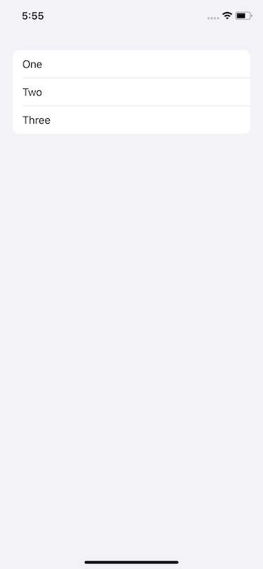
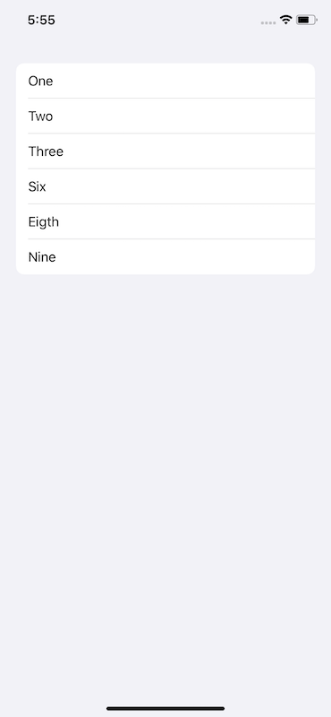
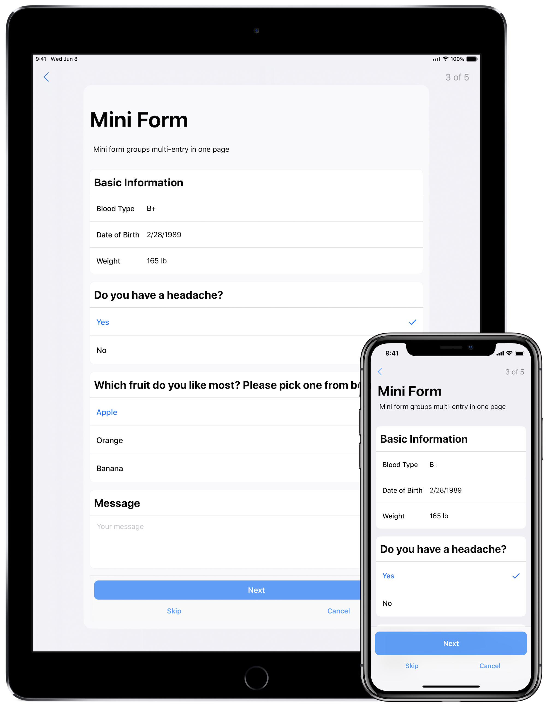

Phew.

This year's WWDC has simply been a monster of the best kind. SwiftUI is a seismic shift, yet it's _far_ from the only relevant news. Now that we've finally got a good look at iOS 13 (and, for the pedantic, iPadOS) and all it has on offer - the problem now becomes knowing where to start and how to focus your attention.

Each year, I dive in on the latest version of iOS and try to surface some of the new APIs that our favorite framework, UIKit, has brought to the table. There is plenty to look at this year, so let's dive right in on some of my favorite additions.

If you want to catch up on this series first, view the [iOS 11][1] and [iOS 12][2] versions of this article.

For now, let's chat UIKit and iOS 13 centerpieces!

### Diffing
Last year, Apple and friends dove in on how to do batch updates the right way. It was a needed session, but the sentiment afterwards was still the same as it ever has been, _it's still hard to get right_.

Well, at least it was.

Now, UIKit offers powerful diffing which pipes right on down to your collection and table views to perform batch updates on your behalf. This is accomplished via a dedicated data source object which works in tandem with snapshots of your ever mutating data.

Take this sample data model:
```swift
struct ExampleRow: Hashable {
    static let cellID = "testID"
    let title: String
    let identifier = UUID()
    func hash(into hasher: inout Hasher) {
        hasher.combine(identifier)
    }
    static func == (lhs: ExampleRow, rhs: ExampleRow) -> Bool {
        return lhs.identifier == rhs.identifier
    }
}

// And this at the controller level for brevity
enum Section: CaseIterable {
    case firstSection
    case secondSection
}

let exampleData = [ExampleRow(title: "One"), ExampleRow(title: "Two"), ExampleRow(title: "Three")]
```

One can apply such a data model to populate either a table or collection view. In our case, a table view - wherein its data source is typed as such:

```swift
var dataSource: UITableViewDiffableDataSource<SectionIdentifierType, ItemIdentifierType>!
// Or a UICollectionViewDiffableDataSource
```

Both the section and item identifier must be `hashable` - and they'll correspond to your sections and their contents when initialized. So, for a single section table view with our data model, it could look like this:

```swift
dataSource = UITableViewDiffableDataSource<Section, ExampleRow>(tableView: tv) { (tableview, indexPath, exampleRow) -> UITableViewCell in
    let demoCell = tableview.dequeueReusableCell(withIdentifier: cellIdentifier, for: indexPath)
    demoCell.textLabel?.text = exampleRow.title
    return demoCell
}
```

This describes to the table view what the data model will look like and how it should be handled, but initially populating it something works much the same way with a concrete `NSDiffableDataSourceSnapshot<SectionIdentifierType, ItemIdentifierType>`:

```swift
let snapshot = NSDiffableDataSourceSnapshot<Section, ExampleRow>()
snapshot.appendSections([.firstSection])
snapshot.appendItems(exampleData)
dataSource.apply(snapshot, animatingDifferences: true)
```

Doing so would give us this:


By applying the diff to the existing data source handler for the table view, the C.R.U.D. operations are applied. This is essentially the flow each time. 

The existing data source handler has a reference to the current diff, so if you simply wanted to add three items to our table view, it might go something like this:

```swift
let snapshot = self.dataSource.snapshot()
snapshot.appendItems([ExampleRow(title: "Six"), ExampleRow(title: "Eigth"), ExampleRow(title: "Nine")], toSection: .firstSection)
self.dataSource.apply(snapshot, animatingDifferences: true)
```

The result:


Peering into the header for diffable snapshot reveals all sorts of things you'd want it do, such as updates, moves, etc.

> One can apply snaphots from any queue, as well. The only requirement is consistency. So, if you update off of main, then one should _always_ apply snapshots off of main.

The flow is much different than what you were used to (a common theme for just about everything announced this year at dub dub), as reliance on a data source conformer along with index paths have less of an emphasis. But the changes are welcome, and they both eliminate a common source of friction for developers and provide a more fluid user experience to consumers.

### Compositional Layouts
Ever wonder how one might go about making the layout in the Apps or Games tab within the App Store on iOS? You've got a central vertically scrolling layout, interspersed with horizontally scrolling layouts. While composing collection or table views within one another works (and is widely used), with iOS 13 - there's a better way.

Enter collection view's new compositional layout:

```swift
let itemSize = NSCollectionLayoutSize(widthDimension: .fractionalWidth(1.0),
                                             heightDimension:.fractionalHeight(1.0))
let item = NSCollectionLayoutItem(layoutSize: itemSize)

let groupSize = NSCollectionLayoutSize(widthDimension: .fractionalWidth(1.0),
                                      heightDimension: .fractionalHeight(0.25))
let group = NSCollectionLayoutGroup.horizontal(layoutSize: groupSize,
                                                 subitems: [item])

let section = NSCollectionLayoutSection(group: group)

let layout = UICollectionViewCompositionalLayout(section: section)

// Now assign it as the layout
collectionView = UICollectionView(frame: view.bounds, collectionViewLayout: layout)
```

The above code produces a table view like experience, where each row spans the full width of the view and each row is about one quarter of its height. At first glance, one might assume our old line breaking layout of yore, `UICollectionViewFlowLayout`, would yield the same results with less code.

And you're right. But looking at it purely with those optics is also missing the point. As the name suggests, composability comes naturally with this new layout. Looking closer we can see by reading from bottom to top that:

```swift
// An item's size
let itemSize = NSCollectionLayoutSize(widthDimension: .fractionalWidth(1.0),
                                             heightDimension:.fractionalHeight(1.0))

// An item in a group
let item = NSCollectionLayoutItem(layoutSize: itemSize)

// A group size
let groupSize = NSCollectionLayoutSize(widthDimension: .fractionalWidth(1.0),
                                      heightDimension: .fractionalHeight(0.25))

// A group has a group size with items
let group = NSCollectionLayoutGroup.horizontal(layoutSize: groupSize,
                                                 subitems: [item])

// A section has groups
let section = NSCollectionLayoutSection(group: group)

// A layout has sections
let layout = UICollectionViewCompositionalLayout(section: section)
```

...it builds on top of itself with a (mostly) _has a_ relationship. This means more complex layouts can be achieved with far less cognitive load than it used to require. Code is read much more than it's written, and this setup makes layouts easier to reason about.

I think Apple saw this, too. Collection view has been around since iOS 6, and in 2018 they gave us the aforementioned session on how to do custom layouts sprinkled with a "We know you find this a bit difficult" kind of sentiment.

Going further, compositional layout gives us this notion of a `NSCollectionLayoutDimension`. Using it, one could size things many different ways:

```swift
let fractionalHeight = NSCollectionLayoutDimension.fractionalHeight(1.0)
let absoluteHeight = NSCollectionLayoutDimension.absolute(44.0)
let estimatedHeight = NSCollectionLayoutDimension.estimated(64)
```

Even better, one can easily mix and match an axis to scroll on, a lá the App Store scenario, by way of `UICollectionLayoutSectionOrthogonalScrollingBehavior`:

```swift
let section = NSCollectionLayoutSection(group: group)

// Default scrolling, more or less
section.orthogonalScrollingBehavior = .continuous

// Rests at the leading edge of the *group's* boundary
section.orthogonalScrollingBehavior = .continuousGroupLeadingBoundary

// Hey, we know this one! Paging driven by the collection view's bounds.
section.orthogonalScrollingBehavior = .paging

// Paging is driven by the section layout group's dimension
section.orthogonalScrollingBehavior = groupPaging 
```

The API design is very well put together and lends itself well to later refactors. And, though I cannot assert with absolute authority that it was Steve Breen who authored it, anyone who rolls up to dub dub to emcee a session wearing a T-Shirt with wolves on it while wearing blue jeans is someone who goes so hard in the paint that I wouldn't even question it if it weren't.

Steve Breen is the G.O.A.T. of dub dub talks - and I've learned quite a lot from all of his content so far. For all of the hoorahs SwiftUI has (deservedly so) received, it can be easy to forget that engineers such as Steve are still here to ensure UIKit stays relevant, efficient and a pragmatic choice to build apps with.

> You may have asked yourself why the `NS` prefix is here in a `UIKit` world? Catalyst, and UIKit for Mac, is likely the reason.

### Scenes
When it comes to vanilla UIKit, this is probably the most foundational change. At its core, scenes allow for iPadOS to kick off multiple instances of your app even though they still all run within one process. Though, even if you aren't targeting iPadOS - it's still a wise choice to adopt the model in your app. The tea leaves are here and they aren't exactly subtle.

Create a new project using the single view template in Xcode 11 and look at the files:

```swift
AppDelegate.swift
SceneDelegate.swift // New, conforms to UIWindowSceneDelegate
```

And in the `info.plist`:

```xml
<key>UIApplicationSceneManifest</key>
    <dict>
        <key>UIApplicationSupportsMultipleScenes</key>
        <true/>
        <key>UISceneConfigurations</key>
        <dict>
            <key>UIWindowSceneSessionRoleApplication</key>
            <array>
                <dict>
                    <key>UILaunchStoryboardName</key>
                    <string>LaunchScreen</string>
                    <key>UISceneConfigurationName</key>
                    <string>Default Configuration</string>
                    <key>UISceneDelegateClassName</key>
                    <string>$(PRODUCT_MODULE_NAME).SceneDelegate</string>
                    <key>UISceneStoryboardFile</key>
                    <string>Main</string>
                </dict>
            </array>
        </dict>
    </dict>
</key>
```

The path of least resistance is to conceptually take your root view construction out of the app delegate, and instead consider the concept of several scenes that could occur - and assign views to those.

The .plist approach, of course, isn't the only way. You can skip the manifest and roll it in code:

```swift
// In your app delegate objecet...
func application(_ application: UIApplication, configurationForConnecting connectingSceneSession: UISceneSession, options: UIScene.ConnectionOptions) -> UISceneConfiguration {
    return UISceneConfiguration(name: "Default Configuration", sessionRole: connectingSceneSession.role)
}

// And then in your scene delegate
func scene(_ scene: UIScene, willConnectTo session: UISceneSession, options connectionOptions: UIScene.ConnectionOptions) {
    guard let windowScene = (scene as? UIWindowScene) else { return }
    let window = UIWindow(windowScene: windowScene)
    window.rootViewController = UIViewController()
    window.makeKeyAndVisible()
}
```

This is a larger subject that I'm personally excited to dive more into, as other app-delegatey things have also moved (such as accepting CloudKit shares). The shift from thinking of an app delegate as a keeper of multiple sessions instead of a 1:1 execution flow allows for all sorts of exciting scenarios.

### Glyphs and Images
No doubt you've heard about a 1,500+ strong icon pack that the crack Apple design team has provided. For the curious among us, you can even download a [dedicated macOS app](https://developer.apple.com/design/downloads/SF-Symbols.dmg){:target="_blank"} to view them all right now.

_Cool! An icon pack!_ 

Nay, it's much more than that. The subtleties are what become difficult about glpyhs - getting them all in the correct weights and sizes, ensuring sure line heights stay in harmony with system fonts or making them big when they should be and small when they shouldn't.

And, that's only after you've got them all exported out and then you've got to tack on the time it takes to maintain them as well. But that's pre iOS 13, because a lot of these pain points have been solved:

```swift
// A pencil glyph
let glyph = UIImage(systemName: "pencil")

// Or overload it according to a traitCollection or image config
let canExpandGlyph = UIImage(systemName: "square.split.2x1", compatibleWith: regularWidthCollection)
let didExpandGlyph = UIImage(systemName: "square.split.2x1.filled", compatibleWith: compactWidthCollection.)
```
While other overloads and techniques exist, that code sample is enough to get you up and going. And that's a good thing.

Another little gimme `UIImage` has given us are class level instances for common user experience actions, like closing or adding an item:

```swift
let closeGlyph = UIImage.close
let addGlyph = UIImage.add
let removeGlyph = UIImage.remove
```

These are just convenience initializers (not in the concrete Swift term) that boil down to what Cupertino and Friends© have deemed most appropriate for those items. For example, in the first beta of iOS 13, `UIImage.close` is returning the "xmark" glyph.

Going further, with the highlighted emphasis Apple has placed upon `UITraitCollection`, it's not a lot of work to make an image (or color) toggle based upon the trait collection housing it. See this [gist](https://gist.github.com/timonus/8b4feb47eccb6dde47ca6320d8fc6b11){:target="_blank"}, via [Tim](https://twitter.com/timonus){:target="_blank"}, to get a feel for what that looks like.

### Bonus - Grouped Inset
This is a small one, albeit one that we should have seen coming for the last year. If you follow [Research Kit's](https://github.com/ResearchKit/ResearchKit){:target="_blank"} development, then it was clear where iOS was taking some of its new table view styles:



The grouped table view hearkens back to the original grouped style, yet it adds a subtle corner radius to the beginning and end cells. The Research Kit team added this style as part of its version 2 release. It's a style that's easily achieved on your own, but why would you?

Enter [.insetGrouped](https://developer.apple.com/documentation/uikit/uitableview/style/insetgrouped){:target="_blank"}:

```swift
let tableView = UITableView(frame: .zero, style: .insetGrouped)
```

Now, you'll get this new style for free.

### Double Bonus - UITraitCollection
I alluded to this earlier, but seriously! So much changed with trait collections, so much was added and so much responsibility was bequeathed unto it with iOS 13 that you just need to book up on it. It's a post for another day, but many would-be problems were solved with it in iOS 13, making things like dark mode friendly to adopt.

### Final Thoughts
WWDC 2019 will certainly be remembered as the year SwiftUI started. With such a powerfully abstracted declarative framework, who knows where it might end up. I can't believe I'm writing this, but SwiftUI could end up being the best way to create even Android apps years from now (doubtful, _but_ not as doubtful as that statement was before last week).

But, even though SwiftUI is _not_ UIKit, the latter is certainly here to stay. And this year, it became better than it ever has been.

Until next time ✌️.

[1]: {{ site.url | append:"/iOS-11-notable-uikit-additions" }}
[2]: {{ site.url | append:"/iOS-12-notable-uikit-additions" }}

