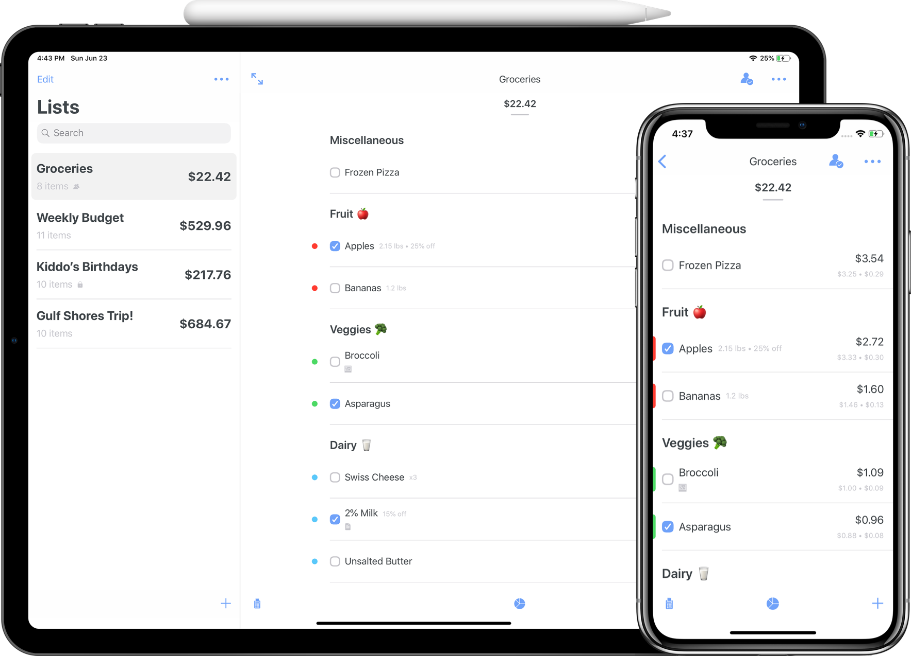

Every app has a story.

You've heard this before, right? Apple pushes it in their messaging, the press lets you know you should tell yours and general marketing revolves around it.

But, each app also needs to solve a problem that's a legitimate pain point for someone.  After several years - I'd love to tell you my app's story and the problem it solved for me. 

Today, I'm pleased to _finally_ introduce the world to [Spend Stack](https://apps.apple.com/app/spend-stack-smarter-lists/id1329068268). It's a list app that can keep an accurate total cost of its items that syncs to your devices, plus you can share and collaborate with others on any list you make. Live edits and all.

### The Elevator Pitch
About five years ago, my wife and I started to budget in all cash. We meticulously split up our money into separate categories each pay period and we still do to this day.

Spend Stack was born when we visited the grocery store during our first crack at this, and we found that it was mostly guesswork, difficult or not possible to keep a running total of our stuff. It's a little aggravating if you walked into the store with $200 but your bill tallied about $250. If you live in the states, this is even more difficult because tax isn't applied to the prices you see on the shelf.

So, I wanted to keep a to-the-penny running total. That meant local sales tax included, pricing by weight, applying discounts via a percentage or fixed amount, etc. 

You can see where this is going - and this was the first reason I built Spend Stack. This is what our grocery list looks like today, and I have no problem keeping track of what something costs with tax, priced by weight and with a discount (as seen here):

At first, I found the problem very concrete, yet each solution I mocked up was entirely too abstract. Over time, even as an autodidact designer, I was able to hone it in to focus on the problem over anything else (another blog post in of itself). With each early, hacked together version we'd discover a different need or obstacle.

My wife wanted to add pictures to items so I would finally stop buying the wrong Chobani (sorry, Jansyn!), so I'd add it in. Tech like CloudKit was naturally included by other factors - such as me not wanting account creation, but also needing lists synced across devices along with the ability to share and collaborate on them with others. Each validated need led to me cracking open Xcode and slotting it in:

The list (no pun intended) goes on.

### The Beta Days
As time went on and I showed it to friends, and those friends tested it out - one thing became clear. A lot of people had a use for a running total list app, but they all used it a bit differently. Some really leaned into the accurate running total, some just wanted to keep a simple one without taxes, discounts, or anything else. What I ended up building was something that could not only adapt to those needs, but try to excel at them.

Today, using the tags system, optional checkbox support and more people make far more than the obvious grocery list. It's been used for birthday lists, Christmas lists, vacation budget planning and more. A family friend even had her daughter track all the money she made doing chores to save up for a pet hamster, checking off tasks as she did them ❤.

It's changed a lot over the years, and at times I've just been stuck analyzing it inside and out. Paralysis by analysis. But I've always believed that high achievement takes place within the framework of high expectations. And my own were high.

Recently, I looked at it, and I thought, "Hmmm, I think this is _kinda_ good now". So, I just hit the submit button. I arrived at a spot where I was actually "proud" of it. For the developer minded reader, here are some things I am personally happy about:

- Full dynamic type support (before it was free with SwiftUI!)
- Every size class and orientation is supported
- Smaller things, like including glyphs for large content size items, à la tapping and holding on a tool bar item when large content sizes are active
- Seamless (I realize that's overused, but it's earned here) syncing between devices
- Full CloudKit sharing, this was not trivial to do
- No use of `reloadData`, everything is diffed and batch reloaded (_also_ before it was free with SwiftUI)
- Undo and redo support for _nearly_ for every single CRUD action
- And I think it looks okay

As an aside, you can see that SwiftUI could be a time saver for me in the future. Hair Force One himself said as much when I cold emailed him about Spend Stack, and that was a fun moment for me:

I basically did the things that draw me to apps I pay for. It's a one time purchase, you can tell the developer cares and is unlikely to abandon it, it works on iPhone and iPad, etc.

### The Human Connection
To close out the story aspect, I think it's fun to show how, that to my wife and I, Spend Stack _truly_ feels like part of the family. Let me explain.

Back in 2013, I was a ball of anxiety when my wife was at the hospital about to deliver our oldest, Bennett. As I paced back and forth, she surprised me with what she said next:

"Try getting out your laptop, work on Spend Stack and relax until my contractions kick in."

So, I did (and it did chill me out....a _little_. Here's my genuine "this is fine" face):

Fast forward to 2016, and I was no more brave at the prospect of my wife delivering a human being that was currently nestled inside of her abdomen. But, until my middle child Remy was ready to arrive, it was the same story. We didn't snap a picture of it that year, but looking back I found this one of Jansyn checking out the latest build in between naps at the hospital a few days postpartum:

...and in 2018 with my daughter Baylor:

It actually became a funny tradition between my wife and I. Of course, there were much bigger things to worry about once the contractions started. But until then, instead of watching me slowly devolve into a crazy, amped up and entirely too anxious husband, she gently suggested to code until our little ones decided to start the action. She's a good one ❤.

So it's funny, this post is an end cap of sorts. We don't plan on having more children, so the days of coding Spend Stack until my wife starts having contractions are behind me. At the same time, it's finally releasing! Life is funny like that, with one chapter ending and another beginning.

### Final Thoughts
So that's my app's story.

It feels so good to launch. I can't emphasis that enough. After years of hard work, it all culminates into this. I'm proud of it, and that was one of the biggest things I wanted out of the project. Something to put my name on and _really_ own it.

Your own app has a story too. And, if you're not telling it, I think you're missing out. I'd love to hear it, at the very least. There is always a human connection behind the pixels on your screen that gets lost in translation from idea to App Store - and for me it's refreshing to discover them. 

Thanks for hearing about my own connection behind Spend Stack, and it's live [here if you'd like to try it out yourself.](https://www.spendstack.com){:target="_blank"}

Until next time ✌️.