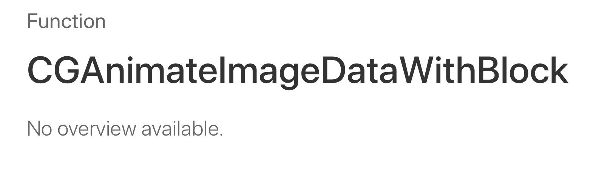

When I was a little boy, I remember that my father could often be found somewhere around the house fixing something up. Never the adroit handymen, but far from incompetent, I would happily would tag along and watch as he would patch up a leaky faucet, swap out an old flickering light bulb or tighten up a loose screw on an old towel rack.

On one particularly cold November morning, I remember he started tending to an old heater that we were using to keep my parent's room nice and toasty amidst the encroaching winter climate. A screw was loose on one of its sides, and the only screwdriver he had laying around was a rusted, weathered Phillips.

The issue, of course, was that this screw was a standard flathead. 

Never the less, he made it work - but was quick to note to his curious sidekick (i.e. me) that this was the incorrect tool for the job. While we'd be able to complete the task, a flathead screwdriver would be far more efficient in tightening things up.

Now, many decades later, I often think back to that day and the universal lesson that myself, and eventually everyone, is taught. Get the right tool for the right job. For years, we've been granted _some_ tools to playback .gifs in iOS. 

But it wasn't until now, with iOS 13, that Apple bequeathed us with the right one, and they barely made a peep about it.

## Blink and You'll Miss it
The first stop I make during beta season is the incredibly valuable API diffs that CodeWorkshop pipes out using their custom CLI tool. Starting with the diff from [iOS 13 beta 2 to 3](http://codeworkshop.net/objc-diff/sdkdiffs/ios/13.0b3/ImageIO.html){:target="_blank"}, I noticed something in particular nestled within Image IO:

```swift
CGAnimateImageAtURLWithBlock()
```

Hmmm. Could this be what I thought it was? A first class API for .gifs? Like many of you, I went to the source of truth to confirm any such notion. But, well...



... <br />
.... <br />
..... <br />

Despite the paucity of information, I tinkered on. As it turns out, Image IO has, in fact, granted us with an excellent way to animate .gifs (and even the slicker, 24-bit variant APNGs) but it's not without some question marks. Namely, if you're thinking of using Apple's flagship programming language, you'll be slightly disappointed.

As of Xcode 11 (11A420a), this isn't even visible to Swift at all. 

Which means I finally I have an excuse to write a post in Objective-C!

### Mirroring the API
To expose this in Swift, the first question I find myself asking is should I expressly bridge over the methods and functionality nearly one to one, or would a custom object or class serve me better?

For me, it's the latter. After I confirmed how the API worked, I created a generic object that hides Image IO's dirty laundry from Swift. To carry out such a task, we need to know what to expose - and here's what this new API offers:

```swift
// Status type
CGImageAnimationStatus

// Errors
kCGImageAnimationStatus_ParameterError
kCGImageAnimationStatus_CorruptInputImage
kCGImageAnimationStatus_UnsupportedFormat
kCGImageAnimationStatus_IncompleteInputImage
kCGImageAnimationStatus_AllocationFailure

// Options for animation
kCGImageAnimationStartIndex
kCGImageAnimationDelayTime
kCGImageAnimationLoopCount
CGImageSourceAnimationBlock

// Animation functions
CGAnimateImageAtURLWithBlock()
CGAnimateImageDataWithBlock()
```

We've got a status that reports how the process is going (via a typedef'd SInt32, OSStatus), some options to express our .gif/APNG presentation preferences (a common pattern in Image IO, and Core Graphics in general) and two different sources we can provide for our .gif or APNG. 

To express this to Swift (or really any client, Objective-C codebases notwithstanding) we might write something like this:

```objc
#import <Foundation/Foundation.h>
#import <CoreGraphics/CoreGraphics.h>
@class UIImage;

typedef void (^ _Nullable onAnimate)(UIImage * _Nullable img, NSError * _Nullable error);

NS_ASSUME_NONNULL_BEGIN

@interface ImageAnimator : NSObject

@property (nonatomic) NSUInteger beginningFrameIndex;
@property (nonatomic) CGFloat delayPerFrame;
@property (nonatomic) NSUInteger loopCount;
@property (nonatomic) BOOL stopPlayback;

- (void)animateImageWithData:(NSData *)data onAnimate:(onAnimate)animationBlock;
- (void)animateImageAtURL:(NSURL *)url onAnimate:(onAnimate)animationBlock;

@end

NS_ASSUME_NONNULL_END
```

Here, we've expressed a simple block to report the resulting image to assign back to our image view, along with an error that you might rely on if the resulting operation didn't work. You'd query for any of the OSStatus errors, returned from either of the two animating functions listed, to check for such a scenario.

Other than that, exposing the options as properties will take us 75% of the way there. The next part is really up to you, and that's opening up the actual animation functions.

There are several different ways to get this done, but I prefer just two dedicated methods. Feel free to vend things through a callback, dependency injection or any other pattern that will achieve much of the same thing. Regardless, simply passing our source of truth for the image is all that's left.

In Image IO's case, this will come either from the network or locally via a chunk of data or just the location of the images via a URL. We've stubbed out both of these at the bottom of the header file above:

```swift
- (void)animateImageWithData:(NSData *)data onAnimate:(onAnimate)animationBlock;
- (void)animateImageAtURL:(NSURL *)url onAnimate:(onAnimate)animationBlock;
```

### Implementation
Of course, since we are in the stone age of Objective-C today (where I [admittedly](https://twitter.com/JordanMorgan10/status/1172882580187881472?s=20){:target="_blank"} love to play) where the header files roam freely, and the square brackets are treated as deity - we mustn't forget to write the other half of our code. Thus, we now arrive at the implementation file.

> Let's not get too hasty, either. For years, the .h and .m paradigm has offered C, C++ and Objective-C many advantages . To learn more, visit your friendly neighborhood [Stack Overflow post](https://stackoverflow.com/questions/2798202/what-are-the-benefits-and-drawbacks-of-using-header-files){:target="_blank"}.

```objc
#import "ImageAnimator.h"
#import "ImageIO/CGImageAnimation.h"
#import <UIKIT/UIKit.h>

@implementation ImageAnimator

#pragma mark - Initializer

- (instancetype)init
{
    self = [super init];
    
    if (self)
    {
        self.beginningFrameIndex = 0;
        self.delayPerFrame = 0.1f;
        self.loopCount = 0;
    }
    
    return self;
}

#pragma mark - Public

- (void)animateImageAtURL:(NSURL *)url onAnimate:(onAnimate)animationBlock
{
    __weak typeof(self) weakSelf = self;
    NSDictionary *options = [self animationOptionsDictionary];
    
    CGAnimateImageAtURLWithBlock((CFURLRef)url, (CFDictionaryRef)options, ^(size_t index, CGImageRef  _Nonnull image, bool * _Nonnull stop) {
        *stop = weakSelf.stopPlayback;
        animationBlock([UIImage imageWithCGImage:image], nil /* report any relevant OSStatus if needed*/);
    });
}

- (void)animateImageWithData:(NSData *)data onAnimate:(onAnimate)animationBlock
{
    __weak typeof(self) weakSelf = self;
    NSDictionary *options = [self animationOptionsDictionary];
    
    CGAnimateImageDataWithBlock((CFDataRef)data, (CFDictionaryRef)options, ^(size_t index, CGImageRef  _Nonnull image, bool * _Nonnull stop) {
        *stop = weakSelf.stopPlayback;
        animationBlock([UIImage imageWithCGImage:image], nil /* report any relevant OSStatus if needed*/);
    });
}

#pragma mark - Private

- (NSDictionary *)animationOptionsDictionary
{
    NSMutableDictionary <NSString *, NSNumber *> *options = [NSMutableDictionary new];
    [options addEntriesFromDictionary:@{(NSString *)kCGImageAnimationStartIndex:@(self.beginningFrameIndex),
                                        (NSString *)kCGImageAnimationDelayTime:@(self.delayPerFrame)}];
    if (self.loopCount > 0)
    {
        options[(NSString *)kCGImageAnimationLoopCount] = @(self.loopCount);
    }
    
    return [options copy];
}

@end
```

There is not much to see here, other than we take care to vend any options we've set before kicking off an animation by combining our properties into a dictionary:

```objc
#pragma mark - Private

- (NSDictionary *)animationOptionsDictionary
{
    NSMutableDictionary <NSString *, NSNumber *> *options = [NSMutableDictionary new];
    [options addEntriesFromDictionary:@{(NSString *)kCGImageAnimationStartIndex:@(self.beginningFrameIndex),
                                        (NSString *)kCGImageAnimationDelayTime:@(self.delayPerFrame)}];
    if (self.loopCount > 0)
    {
        options[(NSString *)kCGImageAnimationLoopCount] = @(self.loopCount);
    }
    
    return [options copy];
}
```

Of note, in my testing I seemed to experience that any .gif would stop after one complete repetition if I passed `kCFNumberPositiveInfinity` as a default value for the loop count. The docs indicate that this should keep things playing - but hey, my aforementioned handyman Dad also told me Santa Clause was real too.

> If you've been away from #TeamDino for some time, the pointer to a boolean may look weird too. However, this approach can be handy in cases where we might want to assign to a boolean (or any other type) later, but lack any context to control it after the initial function invocation. This way, one can set the boolean at any point within the block by referencing another boolean's assignment.

Piping things over to Swift - we've now got a fully functioning class that will allow us to spread the joy of any animated .gif or APNG anywhere on the main queue. So, putting it all together:

```swift
class ViewController: UIViewController 
{
    
    var imageView:UIImageView!
    let animator = ImageAnimator()
    
    override func viewDidLoad() 
    {
        super.viewDidLoad()
        
        imageView = UIImageView()
        view.addSubview(imageView)
        imageView.translatesAutoresizingMaskIntoConstraints = false
        imageView.contentMode = .scaleAspectFit
        
        setupImageViewConstraints()
        
        let gifData = /* Your Gif */

        weak var weakSelf = self
        animator.animateImage(with: gifData) { (image, error) -> Void in
            if let weakImgView = weakSelf?.imageView {
                weakImgView.image = image
            }
        }
    }
}
```

...if you ran such code, you'd enjoy a .gif that would play indefinitely. Of course, setting any of the properties on our `ImageAnimator` class would let you tweak playback however you wish, such as starting at some relevant frame, applying a delay or a playback limit. And, as mentioned above, if one assigns `YES` to `stopPlayback` at any point after playback has started, playback will cease.

### Final Thoughts
The things we take for granted, right? To the end user, .gifs or any sort of animated image is commonplace within iOS. But, developers know there is more than meets the eye. Whether it was firing up a webview, piping an array of images through `UIImageView` or using some other open source library, it was a bit more work than it should have been.

But what you are is just as important as what you aren't. 

On the surface, it's easy to say that `UIImageView` may be built for something like this. But, Image IO is _really_ built for something like this, you know? Its tooling is expressly written to efficiently operate on images, so it feels like the right tool. And in 2019, even though it takes some dancing around to expose in Swift, we can check off playing .gifs or APNG files as another problem solved by Cupertino and Friends©.

Until next time ✌️.