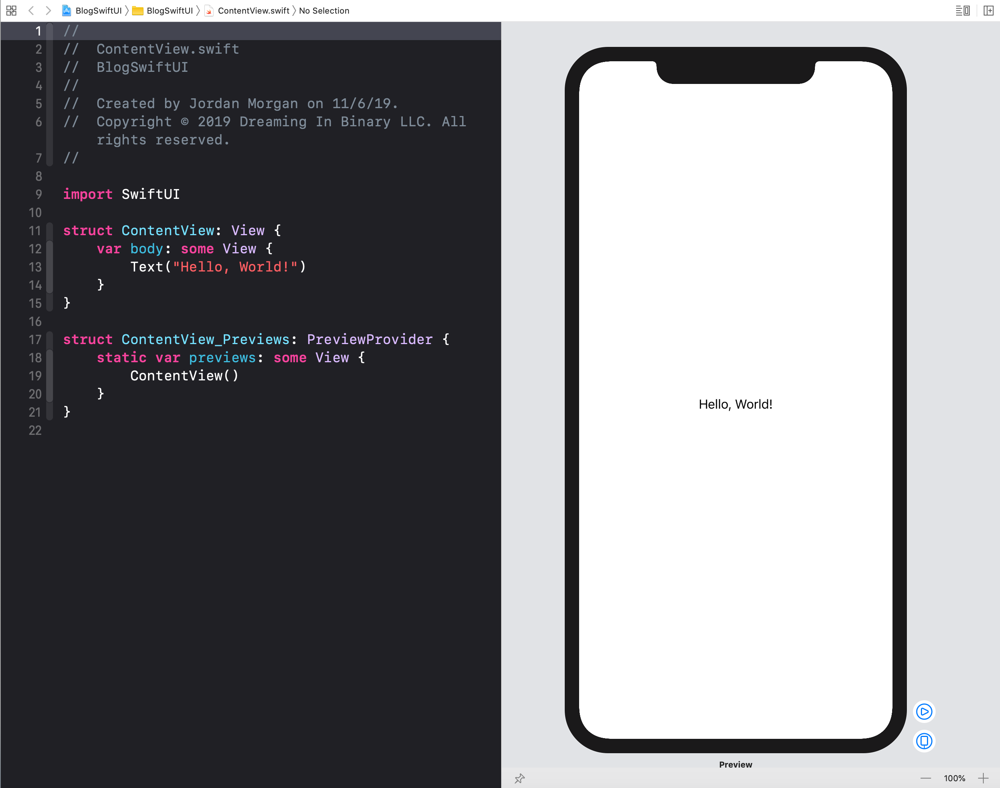

When I created my first SwiftUI project, so much was foreign. I needed to understand how any of this was possible. There was so much that was new, so much that was different - I couldn't stand spinning up a project without knowing how the beast came to be.

After all, there is just _so_ much to talk about it in this one, tiny picture. And none of it was doable before WWDC 2019:



So today I briefly describe how, in the context of the template single view application Xcode provides for SwiftUI, any of this is possible.

Four distinct components stood out to me when surveying the default SwiftUI template from Xcode, feel free to skip to any relevant section:

- [The Syntax](#syntax)
- [The Protocol](#protocol)
- [The Live Previews](#live)
- [The Layout System](#layout)

## The Syntax {#syntax}
We've got to start at the top, and for me that's the Swift code. It's full of little SwiftUI nuggets.

This code snippet might be the poster child of why this is a Swift only framework. Take a close look, and you'll see concepts that didn't exist before Swift 5.1:

```swift
struct ContentView: View {
    var body: some View {
        Text("Hello, World!")
    }
}
```

This was the first bit that peaked my curiosity. Syntactical sugar must've been at the forefront of Cupertino & Friends© collective hive mind, because it seems each new feature slotted into Swift supported one core idea - make it easy to write.

Because without the following tweaks, SwiftUI might look something like this:

```swift
struct ContentView: View {
    var body: AnyView {
        let contentBuilder = ContentBuilder()
        contentBuilder.append(view: Text("Hello, World!"))
        return AnyView(contentBuilder.build())
    }
}
```

#### Return...what exactly?
First off, there's no return statement. True to declarative form, saying what you need and not much else is the route SwiftUI takes (as well it should). As Nate Chandler mentions in the proposal that landed this in Swift, short closures already had implicit returns - so why not extend this to shorthand functions?

And so it was, [SE-0255](https://github.com/apple/swift-evolution/blob/master/proposals/0255-omit-return.md){:target="_blank"} is the first new tool that helps make SwiftUI, SwiftUI.

Now, our would-be code sample changes for the better:

```swift
struct ContentView: View {
    var body: AnyView {
        let contentBuilder = ContentBuilder()
        contentBuilder.append(view: Text("Hello, World!"))
        // No return statement
        AnyView(contentBuilder.build())
    }
}
```

#### That's Some View
Next, [SE-0244](https://github.com/apple/swift-evolution/blob/master/proposals/0244-opaque-result-types.md){:target="_blank"} turns up and makes returning our views much more pragmatic. Opaque result types free us from declaring specific returns types and instead opt to return values that simply implement a protocol contract. Here, the return type will be determined by the `body` implementation before returning back over to SwiftUI, fully abstracted. Before, we could only achieve the reverse of that scenario (i.e. generics where the caller decides what types are bound to generic arguments).

Lipso facto, all SwiftUI needs to know is that we're returning some kind of view, who cares what though. Does it conform to the `View` protocol? Yeah? Awesome - we'll take it from here.

Our pre-Swift 5.1 SwiftUI code sample changes yet again:

```swift
struct ContentView: View {
    var body: some View {
        let contentBuilder = ContentBuilder()
        contentBuilder.append(view: Text("Hello, World!"))
        // No return statement, no type erasure
        contentBuilder.build()
    }
}
```

#### Function Builders
The `body` closure has a `Text` component just chilling in there. If you consider that we have implicit returns now, that might not mean much to you. But if you've waded through SwiftUI's code, you know that's rarely the case. SwiftUI is all about composability:

```swift
struct ContentView: View {
    var body: some View {
        VStack {
            Text("Hi")
            Text("There")
            Text("Dear Reader")
        }
    }
}
```
A new proposal (which is already technically implemented, bringing about a small [point of contention](https://forums.swift.org/t/important-evolution-discussion-of-the-new-dsl-feature-behind-swiftui/25168){:target="_blank"} within the community) makes this work. [Function builders](https://github.com/apple/swift-evolution/blob/9992cf3c11c2d5e0ea20bee98657d93902d5b174/proposals/XXXX-function-builders.md){:target="_blank"} are insanely meta to think about, and their name perfectly describes everything they do.

The gist? A result of a function's statements collate everything together using a builder type, and the result is one value created from the sequence.

> You can see this first hand by looking at the exotic return types one gets from their `body` property. Simply use `print()` along with reflection to check out what types your views are composing to.

Now, our pre Swift 5.1 code sample looks like the real thing:

```swift
struct ContentView: View {
    var body: some View {
        Text("Hello, World!")
    }
}
```

#### Property Wrappers
Bindings, data marshaling, omitting values to subscribers and more are common to the framework. For our case, they aren't shown in a default template app - but it's worth noting all of those are driven by property wrappers. If you want to really see their power, skip everything else and read Mattt's excellent discourse over them [here](https://nshipster.com/propertywrapper/){:target="_blank"}.

So, that's the syntax demystified. But it gets even more interesting when you consider the design aspect - namely, the `View` protocol.

## The Protocol {#protocol}
This is where things start to go off the rails. 

For almost a decade, we've found new patterns, techniques and ways to achieve impressive user interfaces by utilizing M.V.C. and.....the heap. I mean, we've just _piled_ onto the heap.

And why wouldn't we? These were the days before [Krusty](https://developer.apple.com/videos/play/wwdc2015/408/){:target="_blank"} went on and on about protocol oriented programming. Built right on the shoulders of NeXT - Objective-C and UIKit have really stood the test of time. But you are what you are. 

UIKit returns concrete `UIView` types allocated on the heap, that we extend and manipulate via its many robust properties. SwiftUI is _not_ that....at all. Really try to comprehend that and sit on it for a hot second.

Think about the immediate wins you get by creating an entire user interface from the client by simply returning a bunch of Structs on the stack - allowing the underlying details to be optimized and decided by the framework. And, SwiftUI can pick up changes extremely quick by virtue of its design to know what to update and when. It's insane, and awesome.

> For example, it uses static types to optimize parts of its view graph that cannot, and will not, change.

You've simply got to leave `UIKit` *thinking* behind. 

Example: SwiftUI's `frame`. The only thing it has in common with `UIKit` is its name and that it helps with sizing stuff. Everything else is different. It's not a property on a view, it's another function that'll return something conforming to `View`.

```swift
@inlinable public func frame() -> some View
```

So if you tack it onto our `Text` we've been using above, now we've got an entirely new type altogether. 

```swift
var body: some View {
    let myType = Text("Hello, World!")
    print(Mirror(reflecting: myType).subjectType)
    return myType
}

// Prints Text

var body: some View {
    let myType = Text("Hello, World!").frame(width: 200)
    print(Mirror(reflecting: myType).subjectType)
    return myType
}

// Prints ModifiedContent<Text, _FrameLayout>
```

As one Steve Jobs would say....are you getting it!? This isn't one type, this can be many different types!

To me, this is the most exciting technical detail about SwiftUI. As one of the Swift holdouts for a number of reasons, seeing this in action made me realize what Swift has been all about since the beginning - pulling some tomfoolery that Objective-C simply can't do to allow for more robust frameworks and unique ways in which we can use them. And I'm here for it.

> Notice I said "UIKit thinking", not UIKit itself. You can pull it in every which way with representables, or even pump SwiftUI views into UIKit.

## The Live Preview {#live}
The other part of the equation is the hot swapping previews Xcode is slinging. 

_How does that work?_

I was happy to learn more about this, because the roads would eventually lead back to my Objective-C FunTime™ days. In short, Swift is leveraging its dynamic replacement feature.

Xcode knows what we're editing, and here it's our default `ContentView` file. So why not just do delta updates? 

And, in fact, that's kinda what happens. As we can edits, Xcode compiles `ContentView` exclusively from the rest of the project. When it does, it injects the new implementation back into the running application via dynamic replacement.

While we make edits, what our code really looks like that's being executed is closer to this:

```swift
extension ContentView {
    // Dynamically replaced in ContentView's body implementation
    var __preview_body: some View {
        Text("Hello, World!")
    }
}
```
This happens over and over for virtually every edit we make. It's made possible because the amount of changes we make are usually much smaller than recompiling the rest of the app. So once Xcode does its initial build, then it's free to only cherry pick what's new (or deleted) and reflect that within the preview.

Given that - how is it still so fast? Well, it's smart. Things like literal values are just swapped without any recompilation at all!

Even more, the previews that we're seeing are just the result of plain old SwiftUI Code (or, naturally, POSUIC for short, amirite?). As such, we can preview things in so many different contexts now. Here's what I've been doing:

- Display every single locale available to format currency
- I almost always have dark and light mode running together
- Multiple text sizes to represent dynamic type options.

Given that we can also bring our old components in with previews, it almost feels criminal to go back to the old way of doing things. 

## The Layout {#layout}
Perhaps the most encouraging aspect of SwiftUI is its no-nonsense approach to putting elements on screen. Clarity at the point of use is a common term tossed around for Swift's API design guidelines, and I can think of no better example of that term than SwiftUI's layout system.

It's a three step system:

**1)** Parent proposes a size for a given child <br />
**2)** Child considers it, but ultimately chooses its own size <br />
**3)** The parent puts the child in the parent's coordinate space <br />

This is how we arrive at the text being centered in default template app. The parent (i.e. the root view of the device in this case) says "I've got the whole screen!", and so the `Text` looks at it and considers it. In this case, the `Text` says that it's only as big as its intrinsic content size and it can't fill all that space. So the root view has to put it somewhere - so it plants it in the middle. 

But - if we added another view modifier, say `Frame`, then the `Text` would turn rebellious, ignore its parent - and two sheets to the wind, would use it's `Frame` size information instead. Regardless, `ContentView` has what it needs and it's placed according to the layout information on screen.

> In SwiftUI, the top layer of any view with a `body` is said to be "layout neutral". In short - its bounds are defined by the bounds of its body. So, `ContentView` has the same bounds as the `Text` view returned from its `body` property.

When the layout system was being developed, it seems that all of the quirks, gotchas and oddities of UIKit, Auto Layout and frame based approaches were considered, and then sent out back packing. SwiftUI's approach is so easy - so trivial, that my wife looked over my shoulder the other night (who is a nurse with no programming experience) and was able to comprehend what a VStack and HStack were and what they meant.

I liken it to setting up `UIBarButtonItem` controls in UIKit. They just always do what you want and expect. I've never, coming up on a decade, had one issue setting up bar button items. `VStack` and `HStack` have produced the same results for me as well. 

The combination of SwiftUI's semantics and layout system mean I no longer reach for some catch-all sizing control (looking squarely at you, `UIStackView`) and end up with exotic results or frustration. As the Apple mantra goes, it just works.

Further - it can optimized down to metal with one view modifier. While I'm not certain of this, some of the rendering may be already. For example, _something_ is going down with images and more efficient decoding - as sizing the same `UIImage` and `UIImageView` against the same representation in SwiftUI seemed to consume around 25% more memory.

> Another freebie? SwiftUI rounds the corners of views to the nearest pixel to get crisp edges, instead of producing anti-aliased ones.

The immense control a child has over its sizing might be giving you slight anxiety, as to this point, UIKit developers have heavily relied on the parent to position controls. That's still possible too - all one needs to reach for is `GeometryReader`. Its somewhat heavy handed name aside, you can think of it as the UIKit frame of a super view. It reports sizing back to down to children to base things off of its parent's size, should you need it.

Look - this is great. Auto Layout and company are brilliant technologies. But wow - I admire it much more than I enjoy it. In my brief travels with SwiftUI, all of my layouts have been stupid simple to setup. 

And that's exactly what I want out of a layout system.

### Final Thoughts
SwiftUI is incredible. The amount of engineering that's occurring behind the scenes is almost too staggering to comprehend at first, but once you do - seeing what SwiftUI is bringing to the proverbial table becomes clear, and it also reveals a bevy of possibilities of what you can do with it.

Perhaps the best part? There are barely any compromises one has to make to utilize it. Swift, in its infancy, felt like a zero sum game. For all of its marvels, productivity could've been marred by compile times or the lack of ABI stability. SwiftUI, in its early lifespan, feels miles ahead of where it should be (some common complaints mostly related to declarative UI programming notwithstanding).

So it is - code, build, run, navigate almost feels archaic now. I, for one, welcome our Xcode Preview and SwiftUI overlords to my development workflow.

Until next time ✌️.